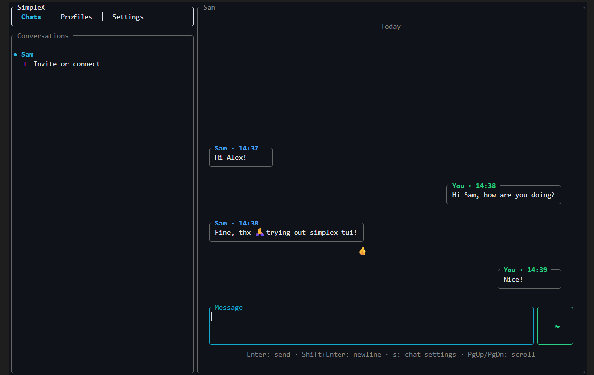

# simplex-tui

## The SimpleX client in your terminal.

<p align="center">
  
</p>

## Installation

### Build from source

To build simplex-tui locally, you need Git and a current Rust toolchain with
Cargo. The recommended way to install Rust and Cargo is
[`rustup`](https://rustup.rs/). The build is supported on Debian/Ubuntu Linux,
macOS, and 64-bit Windows.

1. Clone the repository and enter its directory:

   ```bash
   git clone https://github.com/floscodes/simplex-tui.git
   cd simplex-tui
   ```

2. Build the optimized release binary:

   ```bash
   cargo build --release
   ```

   The first build can take some time. Cargo automatically runs the appropriate
   platform bootstrap script, installs the required native build packages,
   GHC 9.6.3, and Cabal if they are missing, and then compiles the pinned
   SimpleX Chat library and simplex-tui. On macOS, Homebrew is used for system
   packages. On Windows, run the build in the UCRT64 MSYS2 environment installed
   by GHCup. Automatic Linux package installation currently supports
   Debian/Ubuntu.

3. Start simplex-tui:

   ```bash
   ./target/release/simplex-tui
   ```

   On Windows, run `target\release\simplex-tui.exe` instead. Application data
   is stored in `~/.simplex-tui`.

Precompiled binaries will be available soon.

[Ratatui]: https://ratatui.rs
[event driven async template]: https://github.com/ratatui/templates/tree/main/event-driven-async

## Workspace

The repository contains two Rust crates:

- `libsimplex-rs` is the safe, typed Rust wrapper around the official SimpleX
  Chat library. It owns the native ABI, JSON parsing, controller thread and the
  translation of Rust commands into the upstream command language.
- `simplex-tui` contains only terminal application state, input handling and
  Ratatui rendering. It depends on `libsimplex-rs` and does not issue textual
  SimpleX commands or access the Haskell ABI directly.

## SimpleX library integration

The Rust client uses the official C ABI exported by
`Simplex.Chat.Mobile`. This is the same command/event API used by the official
SimpleX clients. The Haskell `simplex-chat` package pins and builds
[`simplexmq`](https://github.com/simplex-chat/simplexmq) itself, so no messaging
protocol is reimplemented in Rust.

On Linux, macOS or 64-bit Windows, build the complete application with:

```bash
cargo build --release
```

Cargo's build script selects the native platform bootstrap, installs the
required build packages, ghcup, GHC 9.6.3 and Cabal when they are missing, then
builds the pinned upstream library before compiling the Rust application. An
existing Cabal installation is reused; its version does not have to match GHC's
version. Linux package
installation currently supports Debian/Ubuntu; macOS uses Homebrew; Windows
uses the UCRT64 MSYS2 environment installed by GHCup. Rust/Cargo itself must
already be installed (for example via rustup).

To prepare only the native library, run the matching script under `scripts/`:
`bootstrap-simplex.sh` on Linux, `bootstrap-simplex-macos.sh` on macOS, or
`bootstrap-simplex-windows.ps1` from PowerShell on Windows. The Haskell compiler
can coexist with the project's regular compiler through ghcup.

For Rust-only checks in an environment where `libsimplex` is intentionally not
available, set `SIMPLEX_SKIP_BOOTSTRAP=1`.
Once the native library exists, Cargo reuses it. Set
`SIMPLEX_FORCE_BOOTSTRAP=1` to rebuild it explicitly.

This checks out the recorded stable SimpleX Chat revision under
`vendor/simplex-chat` and produces a self-contained library directory under
`vendor/libsimplex/`. At runtime, the TUI loads the wrapper with
`libsimplex_rs::Client`, supplies a typed `libsimplex_rs::Config`, and receives
a typed `Session`. Application data lives exclusively under `~/.simplex-tui`;
there is no user-editable configuration file.

The upstream SimpleX sources, the linked library, and both Rust crates in this
workspace are licensed under AGPL-3.0-only. Vendored dependencies retain their
respective licenses.

## License

Copyright (c) floscodes <mail@floscodes.net>

This project, including the `simplex-tui` and `libsimplex-rs` crates, is
licensed under [GNU AGPL v3 only].

[GNU AGPL v3 only]: ./LICENSE
